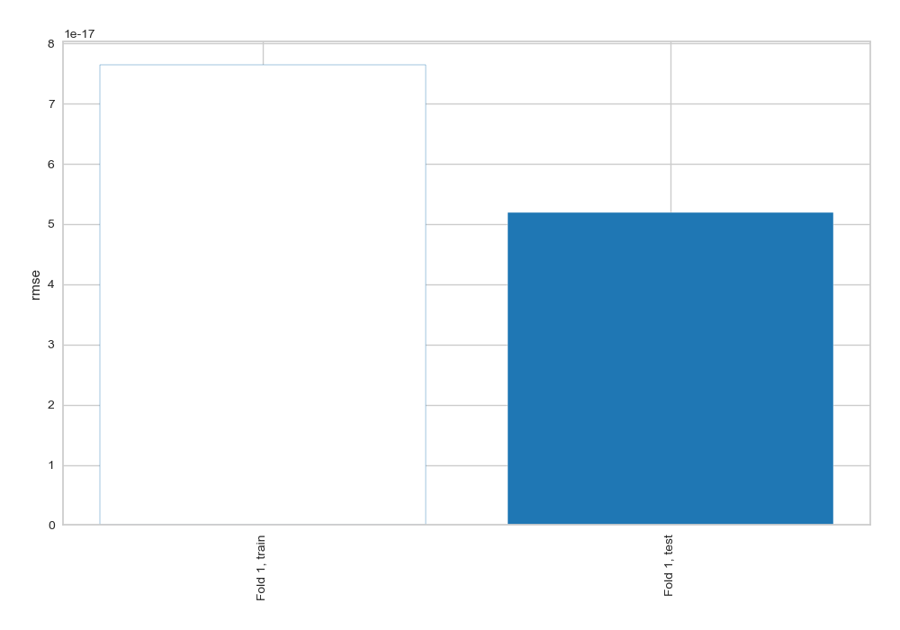
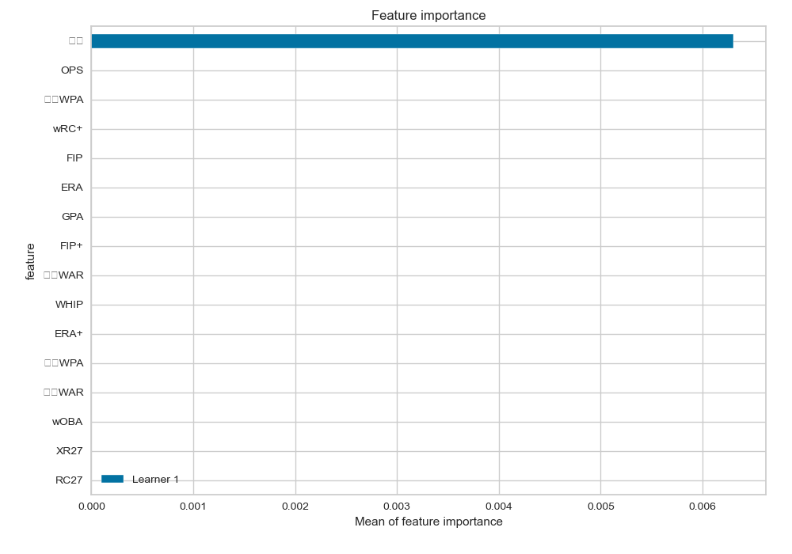
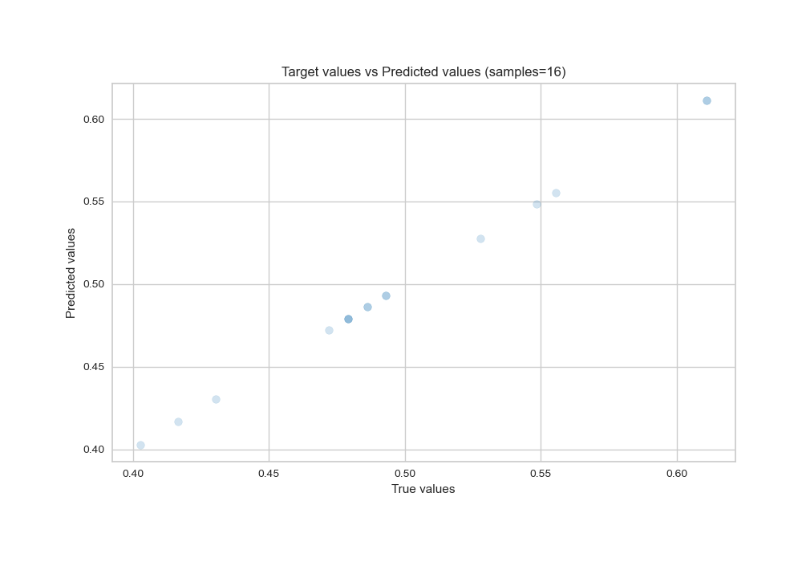
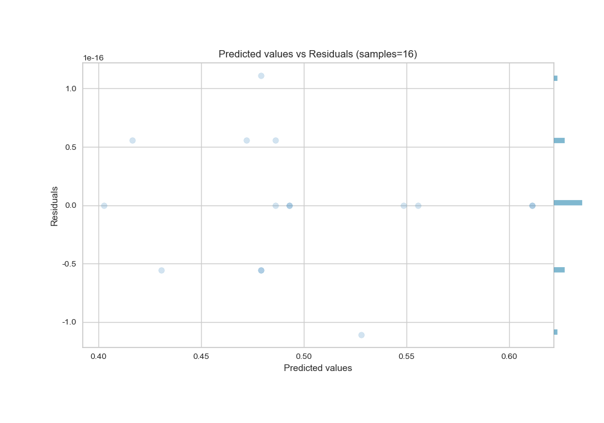
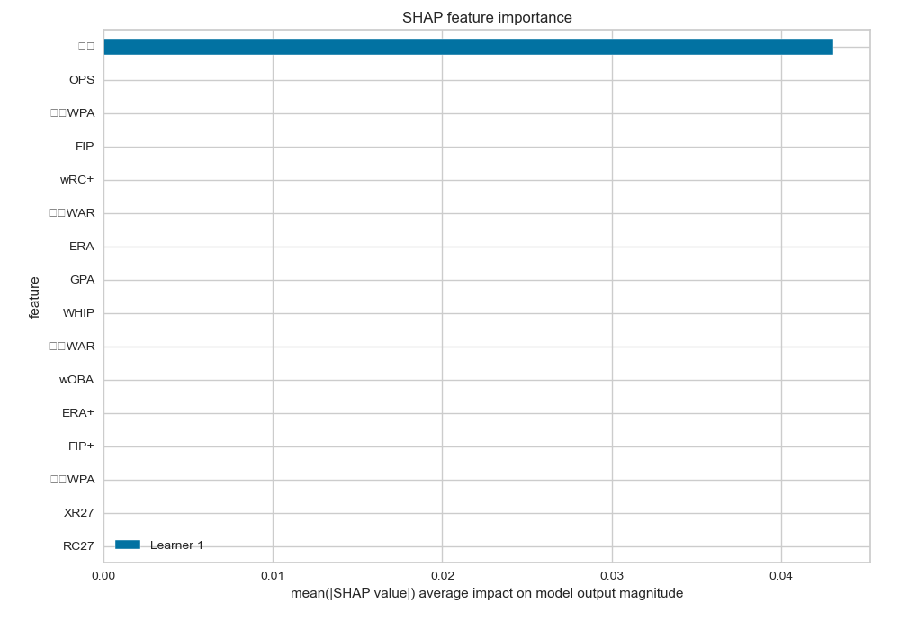
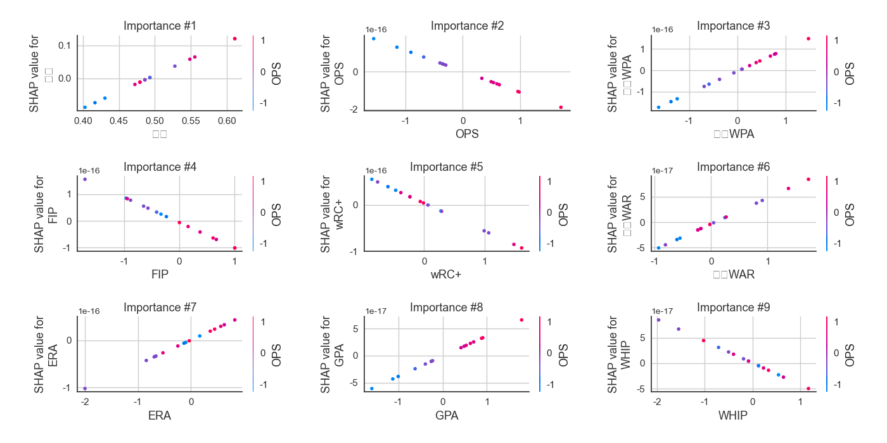
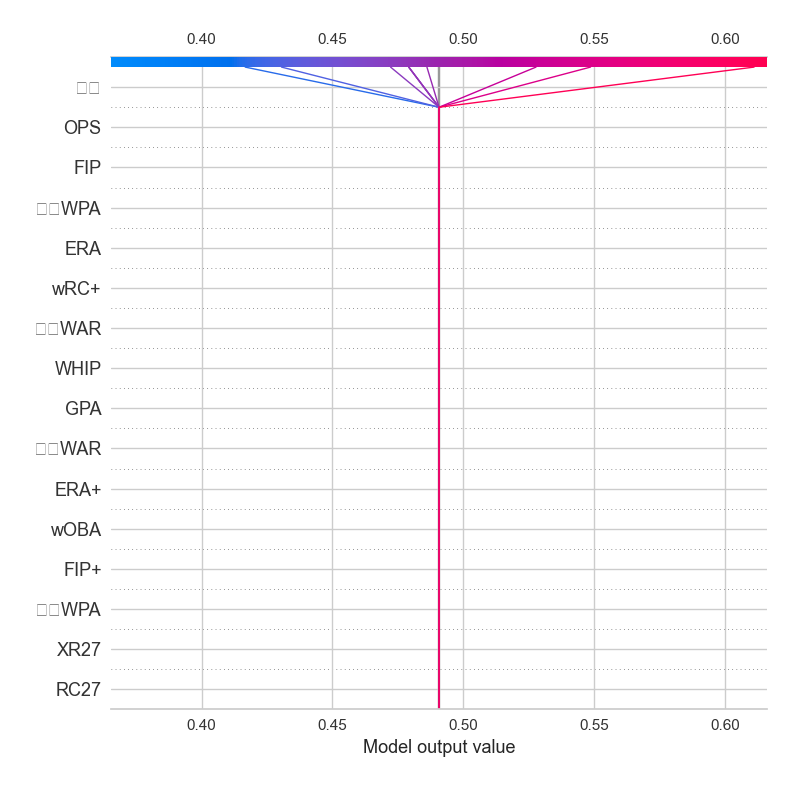
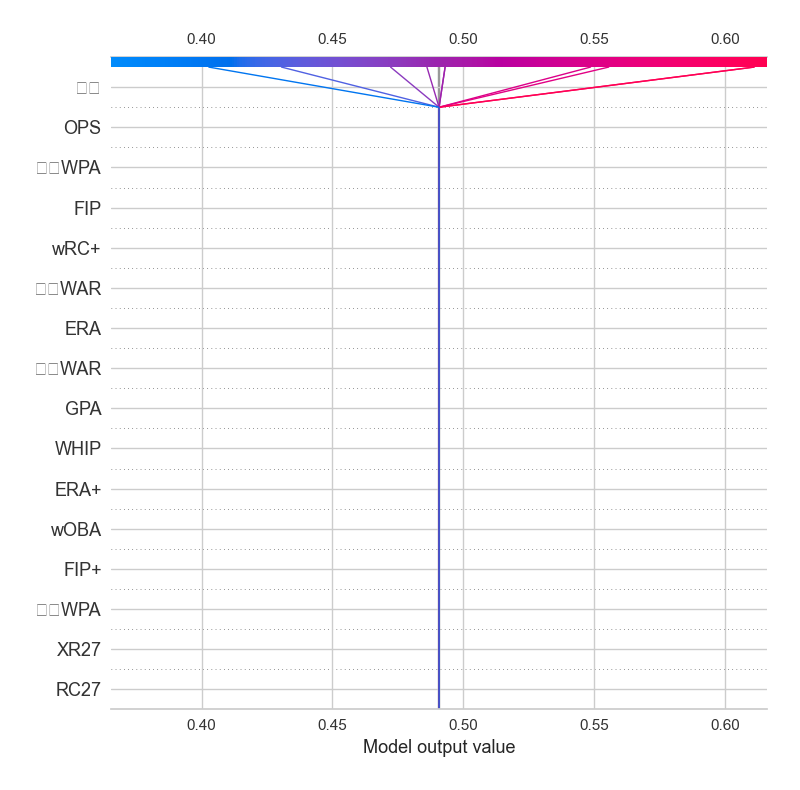

# Summary of 3_Linear

[<< Go back](../README.md)

## Linear Regression (Linear)
- **n_jobs**: -1
- **explain_level**: 2

## Validation
 - **validation_type**: split
 - **train_ratio**: 0.75
 - **shuffle**: True

## Optimized metric
rmse

## Training time

1.1 seconds

### Metric details:
| Metric   |       Score |
|:---------|------------:|
| MAE      | 3.46945e-17 |
| MSE      | 2.6963e-33  |
| RMSE     | 5.19259e-17 |
| R2       | 1           |
| MAPE     | 7.29787e-17 |

## Learning curves

## Coefficients
| feature   |    Learner_1 |
|:----------|-------------:|
| 승률      |  1           |
| intercept |  1.66533e-16 |
| 타자WPA   |  1.03046e-16 |
| ERA       |  5.14704e-17 |
| 타자WAR   |  5.10372e-17 |
| GPA       |  3.74176e-17 |
| 투수WAR   |  3.56542e-17 |
| wOBA      |  2.2319e-17  |
| XR27      |  9.22313e-18 |
| RC27      | -6.03916e-18 |
| 투수WPA   | -1.53272e-17 |
| FIP+      | -1.60822e-17 |
| ERA+      | -1.9226e-17  |
| WHIP      | -4.26748e-17 |
| wRC+      | -5.98545e-17 |
| FIP       | -9.43716e-17 |
| OPS       | -1.11575e-16 |

## Permutation-based Importance

## True vs Predicted

## Predicted vs Residuals

## SHAP Importance

## SHAP Dependence plots

### Dependence (Fold 1)

## SHAP Decision plots

### Top-10 Worst decisions (Fold 1)

### Top-10 Best decisions (Fold 1)

[<< Go back](../README.md)
