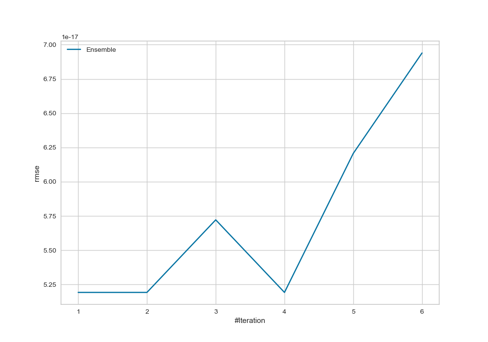
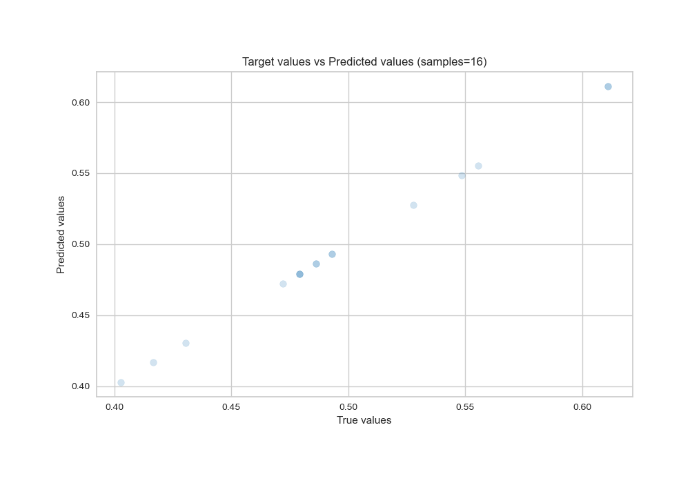

# Summary of Ensemble

[<< Go back](../README.md)

## Ensemble structure
| Model    |   Weight |
|:---------|---------:|
| 3_Linear |        1 |

### Metric details:
| Metric   |       Score |
|:---------|------------:|
| MAE      | 3.46945e-17 |
| MSE      | 2.6963e-33  |
| RMSE     | 5.19259e-17 |
| R2       | 1           |
| MAPE     | 7.29787e-17 |

## Learning curves

## True vs Predicted

## Predicted vs Residuals

[<< Go back](../README.md)
