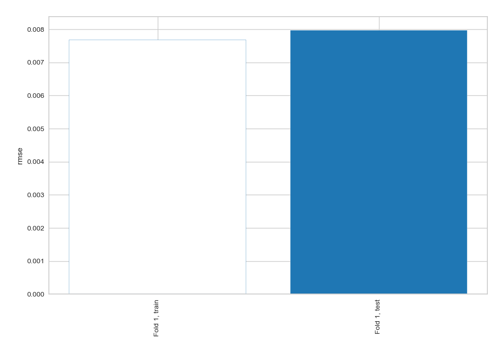
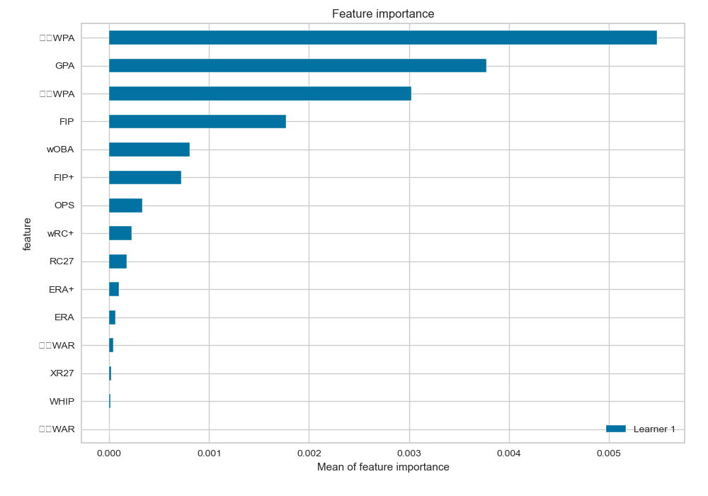
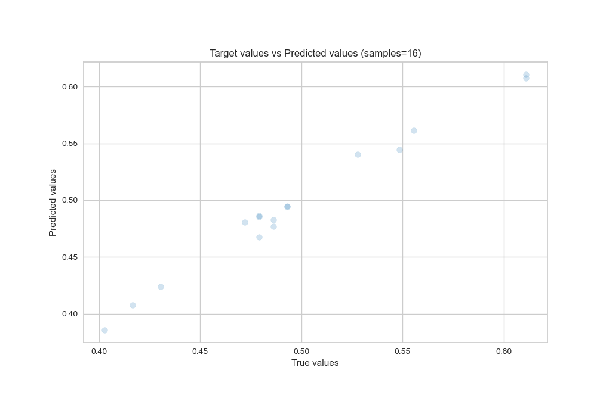
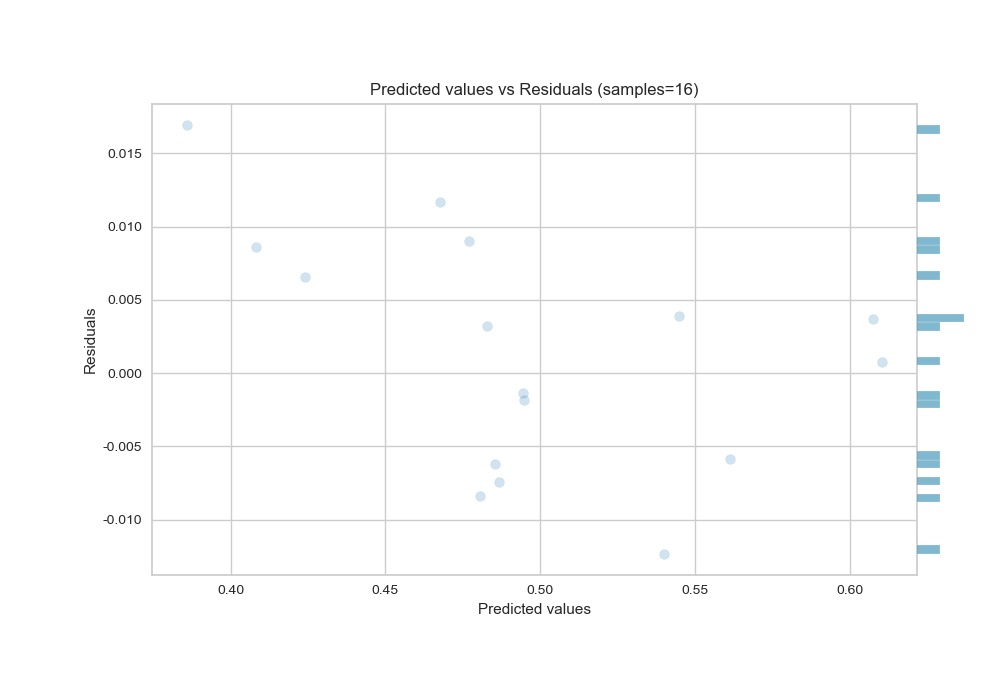
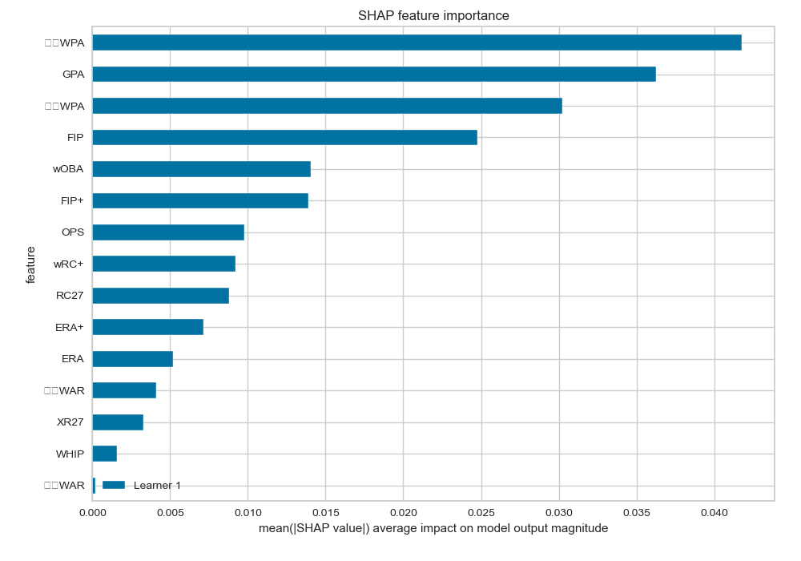
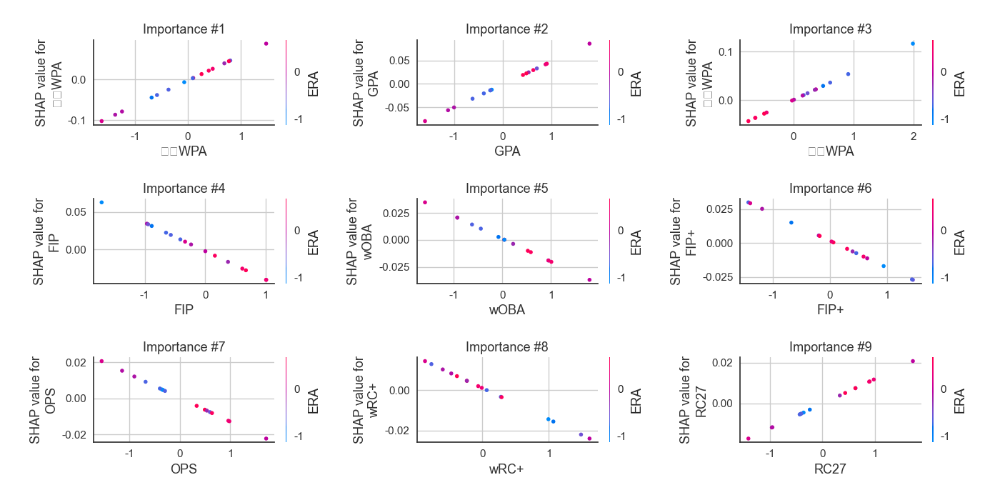
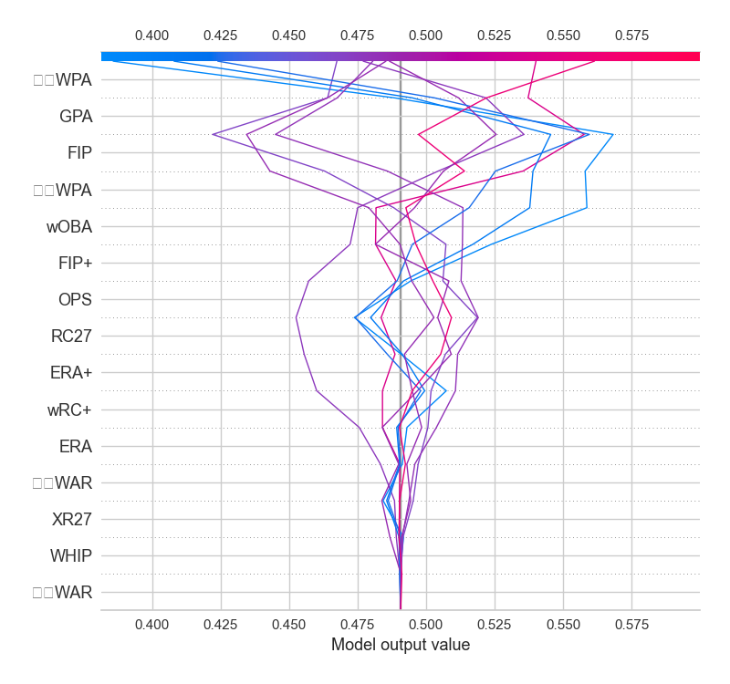
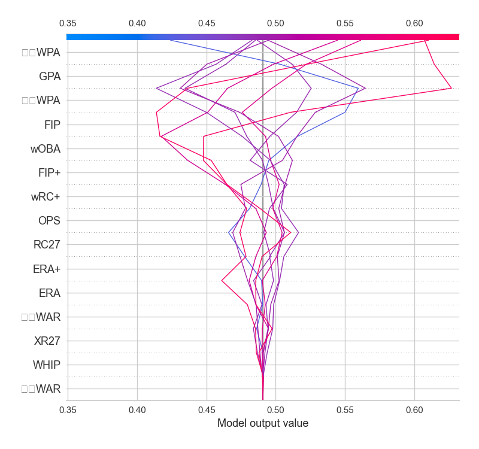

# Summary of 3_Linear

[<< Go back](../README.md)

## Linear Regression (Linear)
- **n_jobs**: -1
- **explain_level**: 2

## Validation
 - **validation_type**: split
 - **train_ratio**: 0.75
 - **shuffle**: True

## Optimized metric
rmse

## Training time

1.1 seconds

### Metric details:
| Metric   |      Score |
|:---------|-----------:|
| MAE      | 0.00673861 |
| MSE      | 6.3637e-05 |
| RMSE     | 0.00797728 |
| R2       | 0.981365   |
| MAPE     | 0.0142848  |

## Learning curves

## Coefficients
| feature   |    Learner_1 |
|:----------|-------------:|
| intercept |  0.489181    |
| 타자WPA   |  0.0611937   |
| 투수WPA   |  0.057914    |
| GPA       |  0.0490982   |
| RC27      |  0.0120316   |
| ERA+      |  0.0102327   |
| ERA       |  0.00935267  |
| XR27      |  0.00483877  |
| WHIP      |  0.00256344  |
| 투수WAR   |  0.000284277 |
| 타자WAR   | -0.00703187  |
| OPS       | -0.0130837   |
| wRC+      | -0.0154406   |
| FIP+      | -0.0198383   |
| wOBA      | -0.0212284   |
| FIP       | -0.0381113   |

## Permutation-based Importance

## True vs Predicted

## Predicted vs Residuals

## SHAP Importance

## SHAP Dependence plots

### Dependence (Fold 1)

## SHAP Decision plots

### Top-10 Worst decisions (Fold 1)

### Top-10 Best decisions (Fold 1)

[<< Go back](../README.md)
