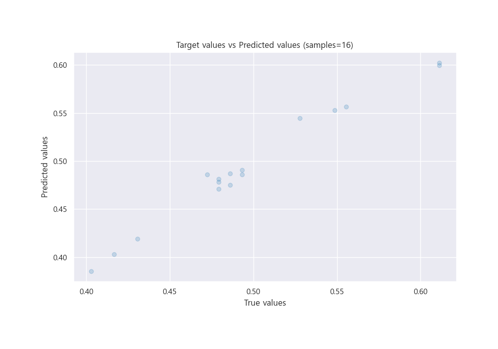

# Summary of 3_Linear

[<< Go back](../README.md)

## Linear Regression (Linear)
- **n_jobs**: -1
- **explain_level**: 2

## Validation
 - **validation_type**: split
 - **train_ratio**: 0.75
 - **shuffle**: True

## Optimized metric
rmse

## Training time

5.9 seconds

### Metric details:
| Metric   |       Score |
|:---------|------------:|
| MAE      | 0.00830825  |
| MSE      | 9.95953e-05 |
| RMSE     | 0.00997975  |
| R2       | 0.970836    |
| MAPE     | 0.0173159   |

## Learning curves

## Coefficients
| feature   |    Learner_1 |
|:----------|-------------:|
| intercept |  0.489165    |
| PWPA      |  0.0581024   |
| BWPA      |  0.0579072   |
| GPA       |  0.0218563   |
| XR27      |  0.0144474   |
| WHIP      |  0.00696641  |
| RC27      |  0.00127026  |
| PWAR      |  0.000459063 |
| BWAR      | -0.00130132  |
| wRC+      | -0.00309257  |
| FIP       | -0.00312473  |
| ERA       | -0.00931498  |
| wOBA      | -0.0276032   |

## Permutation-based Importance

## True vs Predicted

## Predicted vs Residuals

## SHAP Importance

## SHAP Dependence plots

### Dependence (Fold 1)

## SHAP Decision plots

### Top-10 Worst decisions (Fold 1)

### Top-10 Best decisions (Fold 1)

[<< Go back](../README.md)
