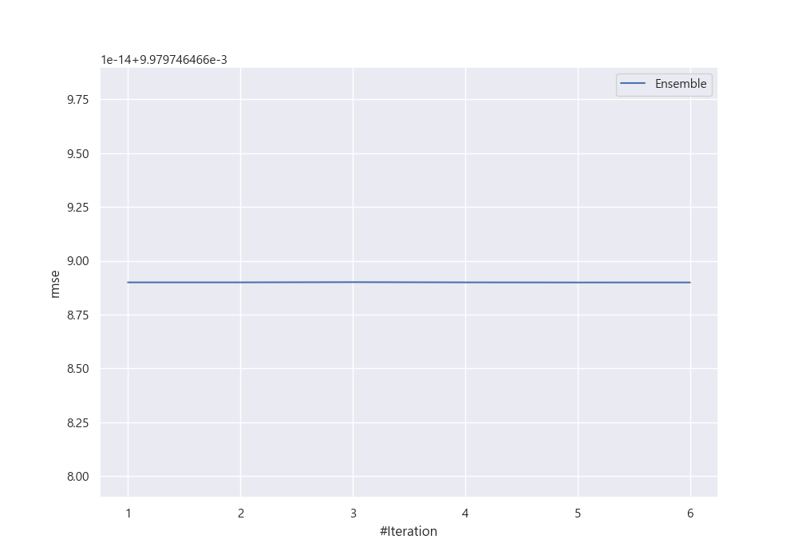
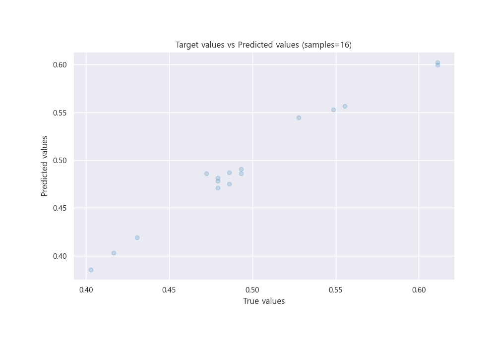

# Summary of Ensemble

[<< Go back](../README.md)

## Ensemble structure
| Model    |   Weight |
|:---------|---------:|
| 3_Linear |        5 |

### Metric details:
| Metric   |       Score |
|:---------|------------:|
| MAE      | 0.00830825  |
| MSE      | 9.95953e-05 |
| RMSE     | 0.00997975  |
| R2       | 0.970836    |
| MAPE     | 0.0173159   |

## Learning curves

## True vs Predicted

## Predicted vs Residuals

[<< Go back](../README.md)
