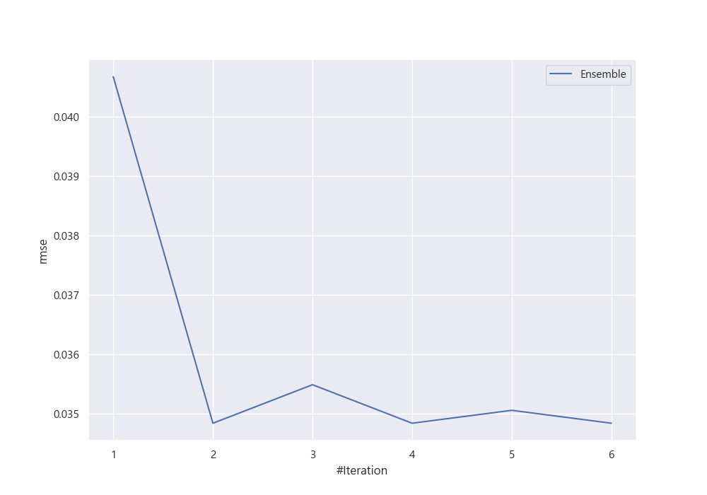
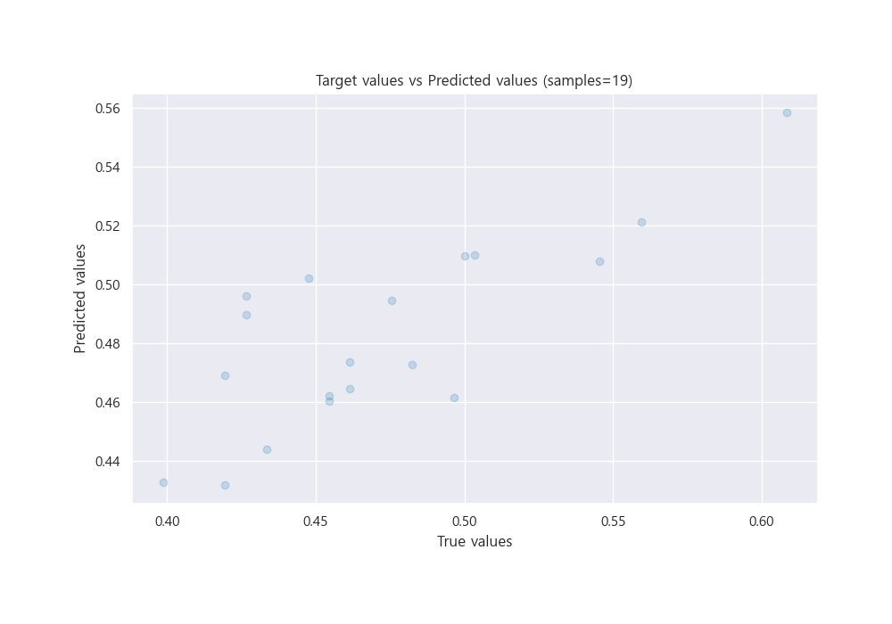
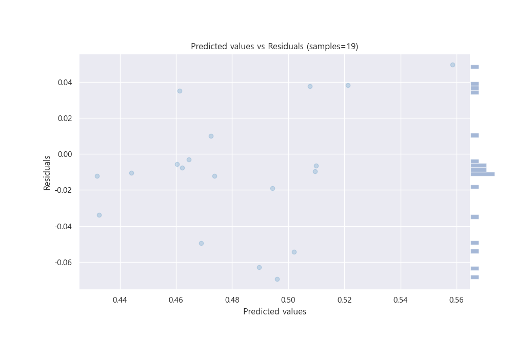

# Summary of Ensemble

[<< Go back](../README.md)

## Ensemble structure
| Model          |   Weight |
|:---------------|---------:|
| 2_DecisionTree |        3 |
| 3_Linear       |        3 |

### Metric details:
| Metric   |      Score |
|:---------|-----------:|
| MAE      | 0.0277428  |
| MSE      | 0.00121358 |
| RMSE     | 0.0348364  |
| R2       | 0.556901   |
| MAPE     | 0.0596195  |

## Learning curves

## True vs Predicted

## Predicted vs Residuals

[<< Go back](../README.md)
