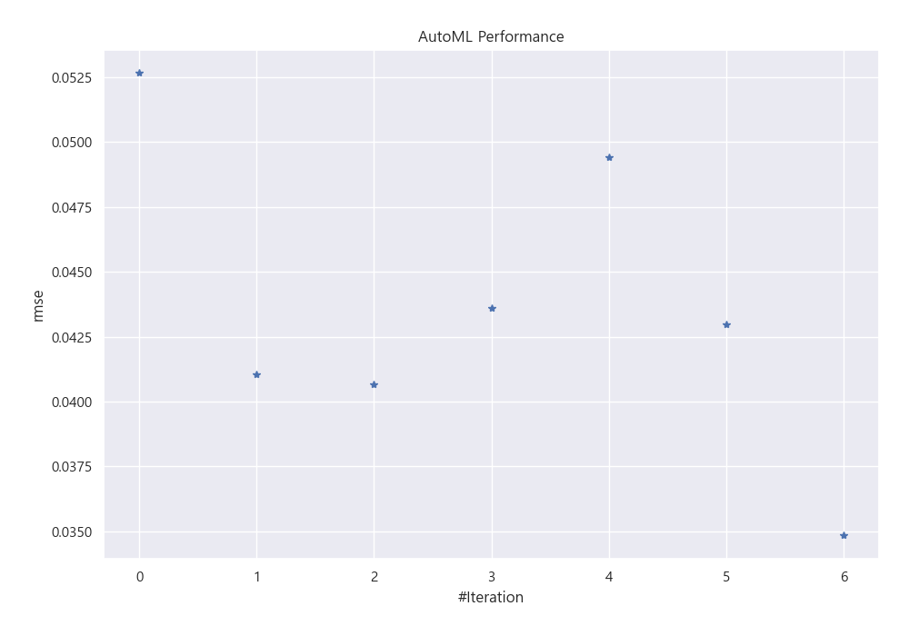
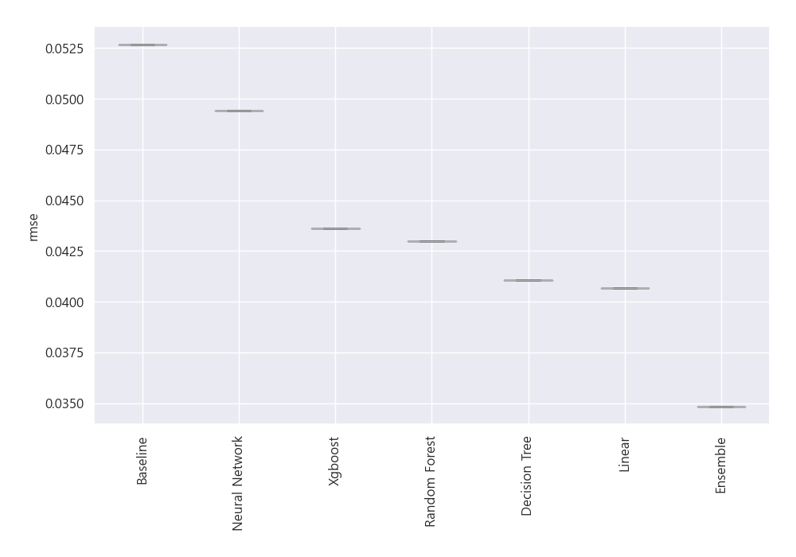
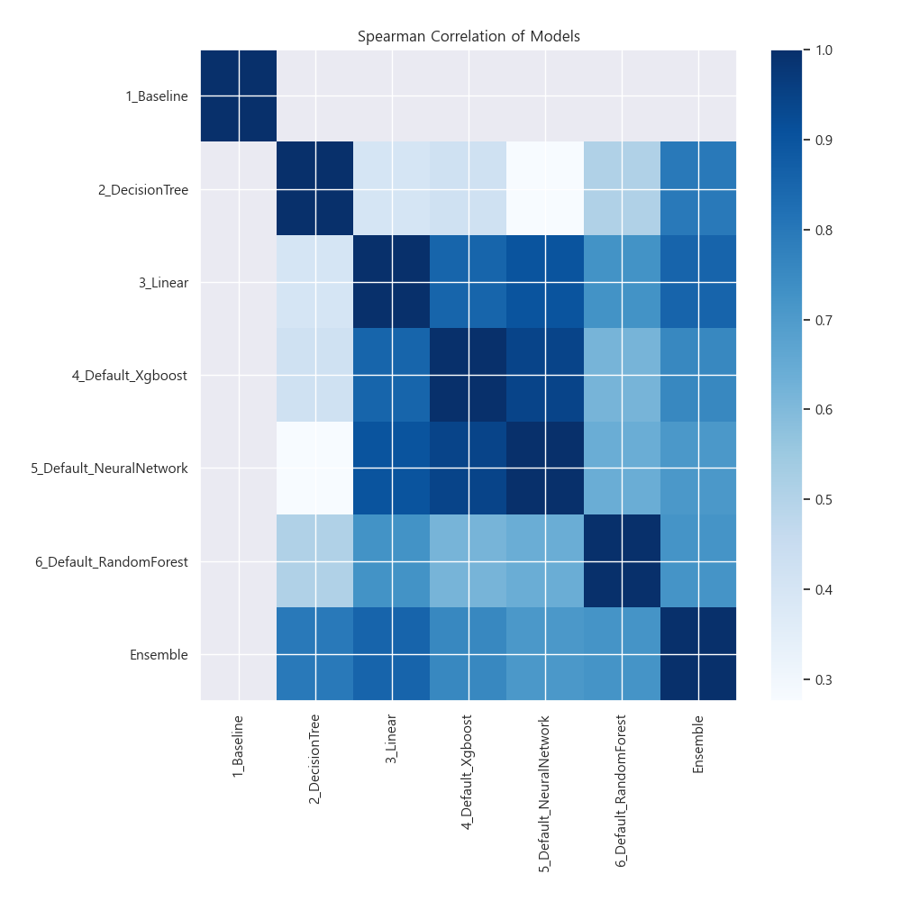

# AutoML Leaderboard

| Best model   | name                                                         | model_type     | metric_type   |   metric_value |   train_time |
|:-------------|:-------------------------------------------------------------|:---------------|:--------------|---------------:|-------------:|
|              | [1_Baseline](1_Baseline/README.md)                           | Baseline       | rmse          |      0.0526696 |         0.3  |
|              | [2_DecisionTree](2_DecisionTree/README.md)                   | Decision Tree  | rmse          |      0.0410444 |         6.24 |
|              | [3_Linear](3_Linear/README.md)                               | Linear         | rmse          |      0.0406744 |         4.81 |
|              | [4_Default_Xgboost](4_Default_Xgboost/README.md)             | Xgboost        | rmse          |      0.0435978 |         5.38 |
|              | [5_Default_NeuralNetwork](5_Default_NeuralNetwork/README.md) | Neural Network | rmse          |      0.0494033 |         4.57 |
|              | [6_Default_RandomForest](6_Default_RandomForest/README.md)   | Random Forest  | rmse          |      0.0429831 |         1.46 |
| **the best** | [Ensemble](Ensemble/README.md)                               | Ensemble       | rmse          |      0.0348364 |         0.15 |

### AutoML Performance

### AutoML Performance Boxplot

### Features Importance

### Spearman Correlation of Models

